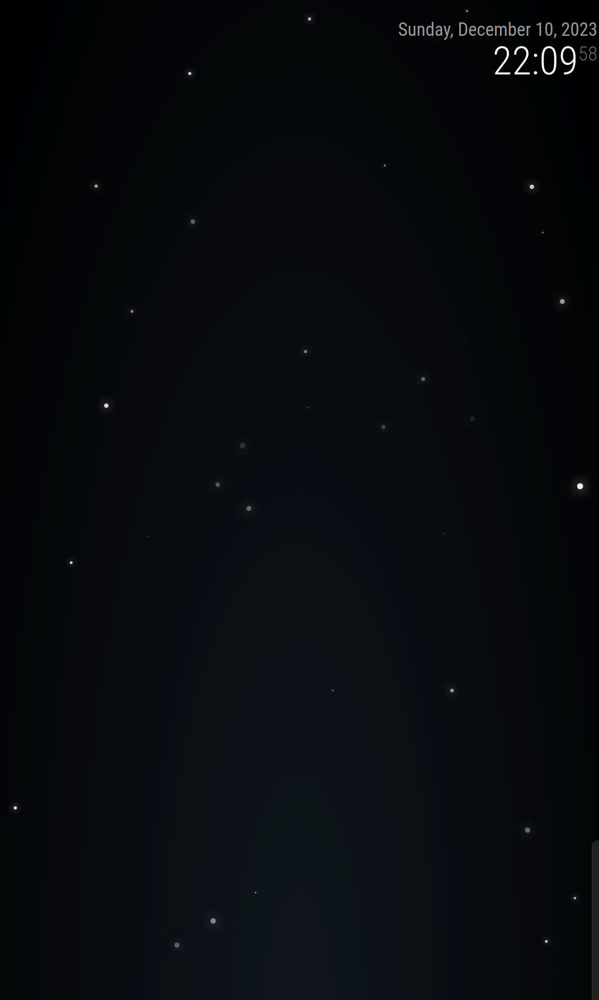

# Module: MMM-Pure-Snow

Inspired by [hyperstown's pure-snow.js](https://github.com/hyperstown/pure-snow.js/blob/master/pure-snow.js) I created a wrapper plugin to improve your winter experience!

**Screenshot**



## Installation

In your terminal, go to your MagicMirror's Module folder:

```
cd ~/MagicMirror/modules
```

Clone this repository:

```
git clone https://github.com/ptornhult/MMM-Pure-Snow.git
```

Configure the module in your `config.js` file.

**Note:** After starting the Mirror, it will take a few seconds before the snow begins to fall ...
**Note:** The snow animation uses CSS to animate falling snow, depending on your hardware this might be very slow 😢

## Using the module

To use this module, add it to the modules array in the `config/config.js` file:

```javascript
modules: [
  {
    module: "MMM-Pure-Snow",
    position: "fullscreen_below",
    config: {
      dataCount: "100",
    },
  },
];
```
